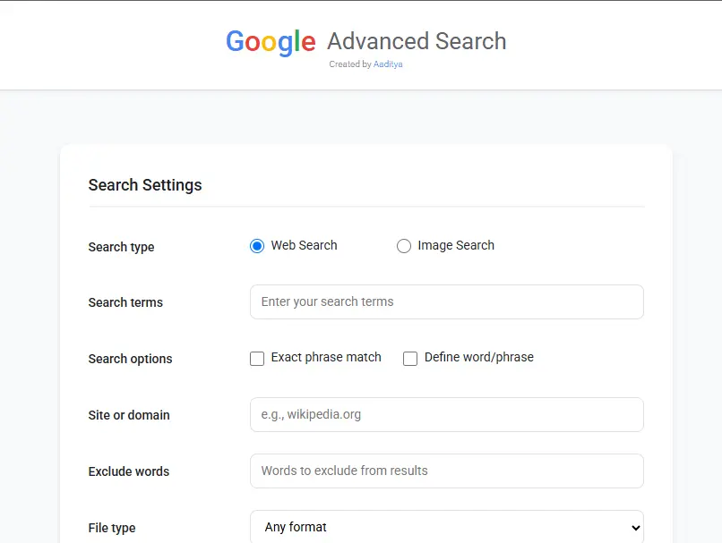

# Advanced Google Search

A powerful and user-friendly web interface for performing advanced Google searches with enhanced filtering capabilities. This tool provides an intuitive way to utilize Google's advanced search features through a clean, modern interface.

## Screenshots

### Desktop View


*Advanced Google Search interface on desktop*

### Mobile View


*Responsive mobile interface*

## Features

### 🔍 Search Types

- **Web Search**: Traditional Google web search with advanced filters
- **Image Search**: Specialized image search with multiple filtering options

### 🎯 Advanced Search Options

- **Exact Phrase Match**: Search for exact word combinations
- **Define Word/Phrase**: Look up definitions of words or phrases
- **Site/Domain Specific**: Limit searches to specific websites or domains
- **Word Exclusion**: Filter out unwanted terms from search results
- **File Type Filter**: Search for specific file formats (PDF, DOC, DOCX, etc.)

### 🖼️ Image Search Filters

- Clipart
- Drawings
- Transparent images
- Vector graphics
- Photographs
- Line art
- Face-specific images
- Animated images (GIF)

## Technologies Used

- HTML5
- CSS3
- JavaScript (Vanilla)
- Font Awesome Icons
- Google Fonts (Roboto)

## Installation

1. Clone the repository:

```bash
git clone https://github.com/AadityaGeek/advanced-search.git
```

2. Open `index.html` in your web browser

No additional setup or dependencies required! The project runs entirely on the client side.

## Usage

1. Select your search type (Web or Image)
2. Enter your search terms in the main search box
3. Configure any desired filters:
   - Toggle exact match or define search if needed
   - Enter site-specific search domains
   - Add words to exclude
   - Select specific file types
   - For image search, select desired image type filters
4. Click "Advanced Search" to see results on Google

## Features in Detail

### Web Search Options

- **Exact Phrase Match**: Wraps your search term in quotes for exact matching
- **Define Search**: Prepends "define:" to your search term
- **Site Search**: Adds "site:" operator to limit results to specific domains
- **Exclude Words**: Adds minus (-) operator before excluded terms
- **File Type**: Adds "filetype:" operator for specific document types

### Image Search Options

- Multiple image type filters that can be combined
- Transparent background filter
- Animation filter for GIFs
- Face detection filter
- Various artistic style filters (clipart, line art, etc.)

## Responsive Design

The interface is fully responsive and works seamlessly across:

- Desktop computers
- Tablets
- Mobile devices

## Browser Compatibility

Compatible with all modern browsers:

- Google Chrome
- Mozilla Firefox
- Microsoft Edge
- Safari
- Opera

## Contributing

Feel free to fork this project and submit pull requests for any improvements.

## Creator

Created by [Aaditya](https://www.linkedin.com/in/aadityakr/)

## Connect

- Twitter: [@aadityakr_](https://twitter.com/aadityakr_)
- GitHub: [AadityaGeek](https://github.com/AadityaGeek)
- LinkedIn: [aadityakr](https://www.linkedin.com/in/aadityakr/)
- Email: work.aadityakumar@gmail.com

## License

This project is open source and available under the [MIT License](LICENSE).

## Acknowledgments

- Google Search for providing the search functionality
- Font Awesome for the icons
- Google Fonts for the Roboto font family
